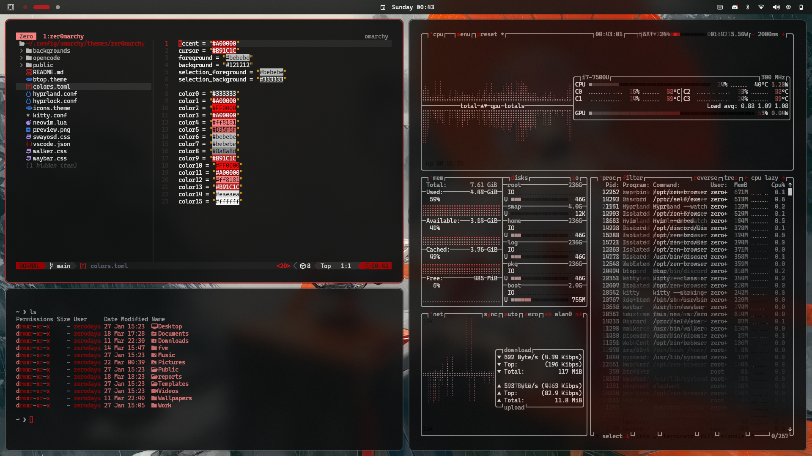
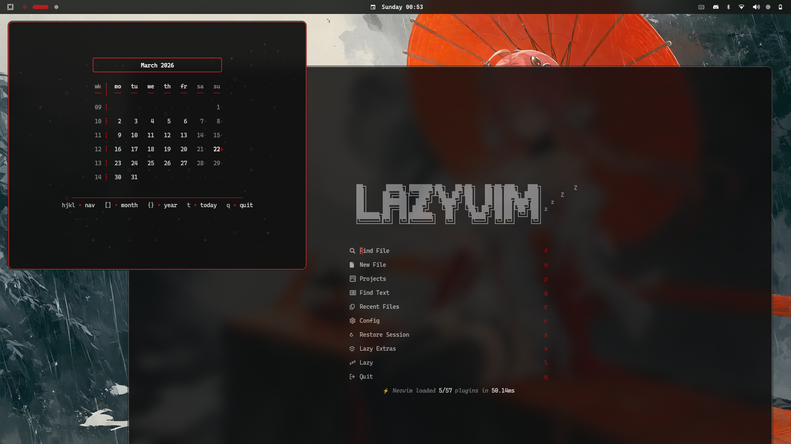
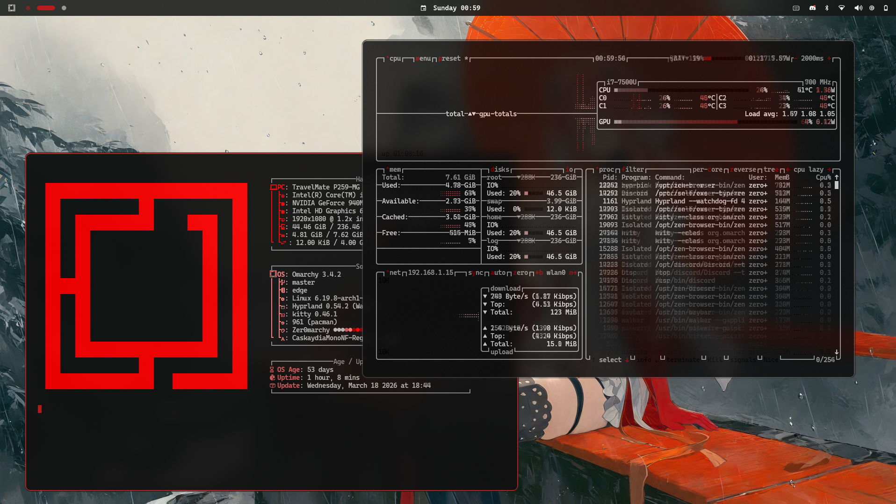

# Zero Omarchy Theme

#### Screenshots





### Other Wallpapers


#### Custom Lazyvim Theme [lazy-min.nvim](https://github.com/Zerodayu/lazy-min.nvim)

- install theme (config > _all-themes.lua_) add line or paste

```lua
  {
    "zerodayu/lazy-min.nvim",
    lazy = true,
    priority = 1000,
  },
```

<br />

#### Opencode global instructions and rules (optional)

- Sync files for consistent changes

```sh
ln -s -f ~/.config/omarchy/themes/zer0marchy/opencode/permissions.json ~/.config/opencode/opencode.json
```

```sh
ln -s -f ~/.config/omarchy/themes/zer0marchy/opencode/AGENTS.md ~/.config/opencode/AGENTS.md
```

#### Waybar integrate [lvsk-calendar](https://github.com/Gianluska/lvsk-calendar) for tui calendar

- opt-in (Install > AUR > _lvsk-calendar_)

```sh
bindd = SUPER SHIFT, C, Calendar, exec, lvsk-calendar-launcher
```

---

> note: to use the waybar config read the comment on `waybar.css` file
